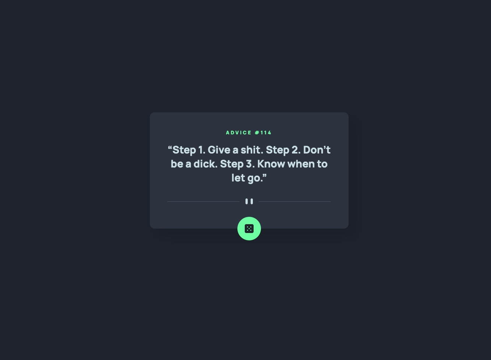

# Frontend Mentor - Advice generator app solution

This is a solution to the [Advice generator app challenge on Frontend Mentor](https://www.frontendmentor.io/challenges/advice-generator-app-QdUG-13db). Frontend Mentor challenges help you improve your coding skills by building realistic projects.

## Table of contents

- [Overview](#overview)
  - [The challenge](#the-challenge)
  - [Screenshot](#screenshot)
  - [Links](#links)
- [My process](#my-process)
  - [Built with](#built-with)
  - [What I learned](#what-i-learned)
  - [Continued development](#continued-development)
  - [Useful resources](#useful-resources)
- [Author](#author)

**Note: Delete this note and update the table of contents based on what sections you keep.**

## Overview

### The challengegit status

Users should be able to:

- View the optimal layout for the app depending on their device's screen size
- See hover states for all interactive elements on the page
- Generate a new piece of advice by clicking the dice icon

### Screenshot

### Links

- Solution URL: [Github](https://github.com/remyboire/advice-generator-app-main)
- Live Site URL: [Github Page](https://remyboire.github.io/advice-generator-app/public/)

## My process

### Built with

- Semantic HTML5 markup
- SCSS
- Plain js

### What I learned

As a junior programmer, I never tried to work with API yet. This challenge was a perfect first approach for me.
I had trouble with fetch cache control because I wasn't aware about it. In my first version I made an setTimeout function who compared the last advice to the new one and loop while those to were similar. I implemented a loader to handle the waiting time.
Adding { cache: 'no-cache' } remove the problem but I kept the loader just in case API doesn't respond fast enough.
I also added a condition when the user click on the button to avoid queuing requests.

### Continued development

I tried to get my code as clean as possible and readable to everyone. I really enjoyed coding the javascript part.

### Useful resources

- [setTimeout](https://developer.mozilla.org/en-US/docs/Web/API/setTimeout) - I discovered this function when I was trying to handle the cache I was not aware of 
- [fetch](https://developer.mozilla.org/en-US/docs/Web/API/Fetch_API/Using_Fetch) - I learn a little bit about Fetch API and feel like I have a lot to learn here !

## Author

- Website - [Rémy Boiré](https://www.remyboire.fr)
- Frontend Mentor - [@remyboire](https://www.frontendmentor.io/profile/remyboire)
